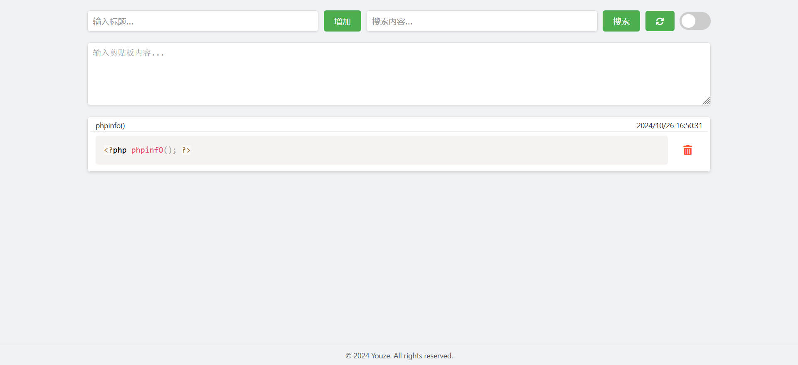
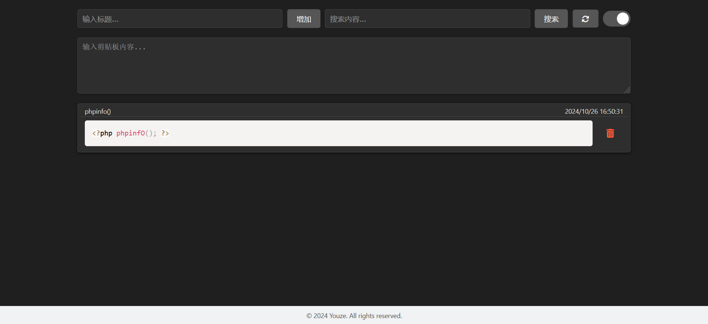

# Clipboard

#### 介绍
剪贴板

#### 软件架构
node.js


#### 安装教程

server 下运行

```
 server目录下：node server.js
 根目录下：node ./server/server.js
 使用宝塔：1.指定项目根目录
          2.自定义启动命令：node ./server/server.js
```





